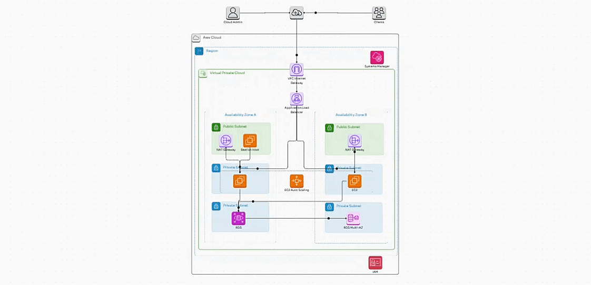

# Configure a VPC to Deploy a Secure, Highly Available, and Scalable Architecture on AWS

In this guide, I will configure a Virtual Private Cloud (VPC) to deploy a Python-based web server and a MySQL database in a secure, highly available, and scalable architecture.

  

## I'm going to deploy the next cloud architecture on AWS


<hr>
1. I'll build the network architecture using the AWS VPC service.

   - I'm going to create a VPC with the following IPv4 CIDR Block
     - 192.168.0.0/16
    
   - I will create the three subnets with the next names:
     - **PublicSubnetA**:
          - Availability Zone: a
          - CIDR: 192.168.1.0/24
            
      - **PublicSubnetB**:
          - Availability Zone: b
          - CIDR: 192.168.2.0/24
      
     - **PrivateSubnetA**:
          - Availability Zone: a
          - CIDR: 192.168.3.0/24
      
     - **PrivateSubnetB**:
          - Availability Zone: b
          - CIDR: 192.168.4.0/24
            
     - **PrivateSubnetAA**:
          - Availability Zone: a
          - CIDR: 192.168.5.0/24
      
     - **PrivateSubnetBB**:
          - Availability Zone: b
          - CIDR: 192.168.6.0/24

   I need the VPC to have an Internet connection so I need to configure an **Internet Gateway**.
   - When the Internet Gateway is created, I attach it to the VPC
   - I create a Route Table
   - In the Route Table associate with the two **Public Subnet** and I create a route for allow to connect to the Internet through the **Internet Gateway**  

<hr>
2. I'll use the AWS System Manager service to store the connection parameters that the web server will use to connect to the database configured on AWS RDS.

   - Using AWS System Manager with Parameter Store I create the following parameters:
      - /book/user: root
      - /book/password: *Test!2024* using the *SecureString* type
      - /book/database: books_db
      - /book/host: 192.168.1.23 *The IP address where the database is located. When creating the database on RDS I need to change this IP address to the endpoint provided by RDS*.
      
   - The web server will run in the EC2 instance and it needs to read the connection parameters to the database deployed on RDS, so I need to create an IAM role that has permission to EC2 to read the connection parameters from the System Manager service.
      - In the IAM service I create a role named *ec2RoleSSM*.
      - The Role has the following permission:
         - SSMFullAccess           

<hr>

3. I going to the AWS EC2 service and I create four security groups.

      - The first security group has the next parameters:
      
         - Name: alb-SG
         - Inboud rules:
            - Type: Custom TCP
            - Port Range: 80
            - Source: Anywhere
              
      - The second security group has the next parameters:
      
         - Name: web-server-SG
         - Inboud rules:
            - Type: Custom TCP
            - Port Range: 5000
            - Source: alb-SG *(The SG of the application load balancer)*
              
      - The third security group has the next parameters:
       
         - Name: database-SG
         - Inboud rules:
            - Type: MYSQL/Aurora
            - Port Range: 3306
            - Source: web-server-SG *(The SG of the web server)*

      - The four security group has the next parameters:
       
         - Name: bastionHost-SG
         - Inboud rules:
            - Type: ssh
            - Port Range: 22
            - Source: MyIP
<hr>

4. I going to the AWS EC2 service and I launch an EC2 instance in the **PublicSubnet** with the next configurations
     - AMI: *Amazon Linux 2023*
     - Instance Type: *t2.micro*
     - Key Pair: associate a key pair
     - Network settings:
        - VPC
        - Public Subnet: enable *Public IP*
        - Associate the bastion host security group
     - Advanced details:
        - IAM instance profile: Associate the role created previously
        - User data: *copy the next following lines to the user data*
           ```
           #!/bin/bash
           sudo dnf install -y python3.9-pip
           pip install virtualenv
           sudo dnf install -y mariadb105-server
           sudo dnf install -y git
           sudo service mariadb start
           sudo chkconfig mariadb on
           pip install flask
           pip install mysql-connector-python
           pip install boto3
           git clone https://github.com/jhorvi24/architecture-ha-hs.git
            ```
      - Once the instance launch is complete, I connect to the terminal, test that the libraries are installed and that the repository has been cloned to EC2.  
                   
      - To run the web server, I run the next command in the directory where the app.py is located. You need to make sure that the security group has the appropriate port enabled.

               python3 -m virtualenv venv
               source venv/bin/activate
               python app.py 
               
      - The database is not configured. I'm going to directory named databases and I run the next commands
        
                sudo chmod +x set-root-user.sh createdb.sh
                sudo ./set-root-user.sh
                sudo ./createdb.sh
      
      - You can check if the database was created running the next command:
        
                sudo mysql 
                show databases;
                use books_db;
                show tables;
                SELECT * FROM Books; 
        
      - The database is not configured in AWS RDS but in AWS EC2. So, later on, I will configure AWS RDS.
      - From the instance terminal create the following file

                sudo nano /etc/systemd/system/bookapp.service
        
      - This file should have the following code
        
               [Unit]
               Description=My Flask Application
                       
               [Service]
               User=ec2-user     
               WorkingDirectory=/home/ec2-user/ec2-rds-ssm-python
               ExecStart=/usr/bin/python3 /home/ec2-user/ec2-rds-ssm-python/app.py
               Restart=always
               
               [Install]
               WantedBy=multi-user.target
        
      - You need reload the deamon
        
              sudo systemctl daemon-reload
        
      - You need to start the service
        
              sudo systemctl start bookapp
        
      - You must enable the service when the instance starts.
        
              sudo systemctl enable bookapp 
<hr>
   
5. I'm going to the AWS RDS to configure the relational database service.
   
   - I create a subnet group for privateSubnetAA and privateSubnetBB.
   - I create AWS RDS with the next parameters:       
   
      - Engine Type: MariaDB or MySQL
      - Templates: Free tier
        
         - Master username: the same user that you created in AWS System Manager
         - Master Password: the same password that you created in AWS System Manager.
         - Virtual Private Cloud (VPC): the VPC that was created in the step one. 
         - DB subnet group: the db subnet group created. 
         - Existing VPC security groups: Associate the database security group create in the step three.

         - When AWS RDS is finally created, I copy the RDS endpoint. You can update the /book/host parameter in AWS System Manager.
<hr>

6. In this step, I'll be migrating the database on AWS EC2 to AWS RDS.
   
   - From the terminal of the AWS EC2 instance, I run the next commands:
   - I check the connection to AWS RDS from AWS EC2
     
             mysql -u root -p --host rds-endpoint
             show databases;
   
   
   - I begin with the migration with the next commands:
   
             mysqldump --databases books_db -u root -p > bookDB.sql
             mysql -u root -p --host *rds-endpoint* < bookDB.sql
   
   - You can check if the migration was successful
   
             mysql -u root -p --host *rds-endpoint*
             show databases;
             show tables;
             SELECT * FROM Books; 
   
<hr>

7. I'm going to configure the Auto Scaling Group and the Application Load Balancer.
   
   -Go to EC2 service in AWS.
   - Select the instance (Bastion Host) launched in the public Subnet and create an AMI.
   - Create a Launch Template with the AMI created before. For the Launch Template Configuration:
      - Do not choose VPC.
      - Assign IAM Role.
      - Create key Pair: PEM
   - Go to Auto Scaling group.
      - Choose the Launch Template configured before.
      - Do not choose Load Balancer.
      - Select the private subnets in which the instances managed by the Auto Scaling group will be launched.
      - Configure the Scaling Policy.
   - Go to Load Balancers
      - Choose Application Load Balancer
      - Choose the VPC created before and the two Public Subnets.
      - Create a Target Group.
         - Configure the Port in 5000 (web server)
         - Define the Health check path as: /health       
   - In the Auto Scaling group configuration, associate the load balancer with Auto Scaling Group.
           
   
9. Finally, you can test whether the application response from the Application Load Balancer.
    
   - If the application does not respond from the application load balancer you check the next:
      - Restart the service using System Manager
         - Select Fleet Manager.
         - Select the IDs of the instances running in the private subnet.
         - Search AWS-RunShellScript
         - Write the next commands:
                  sudo systemctl restart bookapp.

      - Check the securities Groups. 
   
